# Relatório de Laboratório

Laboratório de Experimentação de Software — Lab01: Características de Repositórios Populares no GitHub

| Curso | Engenharia de Software |
| --- | --- |
| Disciplina | Laboratório de Experimentação de Software |
| Turno / Período | Noite / 6º |
| Professor(a) | Danilo Maia |
| Laboratório | Lab01 — Características de Repositórios Populares no GitHub |
| Grupo (trio) | Víctor Gabriel Cruz Pereira · Jonathan Sena da Silva · Matheus Fernandes de Oliveira |
| Link do repositório / GitHub Projects | https://github.com/Victorgabrielcruz/lab-medicao-e-experimentacao-de-software · https://github.com/users/Victorgabrielcruz/projects/4/views/1 |
| Data de entrega | 27/08/2026 |

---

## 1. Introdução

Repositórios populares no GitHub concentram grande parte da atenção da comunidade open-source, mas nem sempre fica claro o que, na prática, diferencia esses projetos: se são necessariamente antigos, se recebem muita contribuição externa, se são mantidos com frequência, ou se a linguagem de programação influencia esse comportamento. Este laboratório investiga essas questões de forma empírica, minerando os 1.000 repositórios com mais estrelas no GitHub e cruzando métricas de idade, contribuição, releases, atividade, linguagem e issues.

O laboratório é guiado por sete Questões de Pesquisa (RQs), cada uma com uma hipótese informal definida antes da coleta dos dados oficiais:

* **RQ01.** Sistemas populares são maduros/antigos? *Hipótese:* sim, projetos que se mantêm populares tendem a acumular mais tempo de desenvolvimento e manutenção.
* **RQ02.** Sistemas populares recebem muita contribuição externa? *Hipótese:* sim, mais popularidade atrai mais colaboradores e, portanto, mais Pull Requests aceitas.
* **RQ03.** Sistemas populares lançam releases com frequência? *Hipótese:* sim, projeto popular e maduro tende a versionar entregas de forma explícita.
* **RQ04.** Sistemas populares são atualizados com frequência? *Hipótese:* em geral sim, mas com uma parcela relevante de projetos que ganharam popularidade no passado e hoje estão parados.
* **RQ05.** Sistemas populares são escritos nas linguagens mais populares? *Hipótese:* sim, na maior parte dos casos, usando o ranking do GitHub Octoverse 2025 como referência.
* **RQ06.** Sistemas populares possuem um alto percentual de issues fechadas? *Hipótese:* sim, pois teriam mais mantenedores disponíveis para triagem e fechamento.
* **RQ07.** Sistemas em linguagens mais populares recebem mais contribuição externa, lançam mais releases e são atualizados com mais frequência? *Hipótese:* sim, por estarem em ecossistemas com mais desenvolvedores disponíveis.

Além do enunciado, o grupo optou por três frentes adicionais de contribuição (detalhadas na seção 3.6): (1) uma análise de outliers por métrica, usando a regra de Tukey/IQR; (2) um dashboard interativo em Streamlit para explorar todos os resultados e exportar gráficos/dados; (3) uma correlação direta entre estrelas e as métricas de RQ01–RQ06 dentro da RQ07, complementando a comparação por grupo pedida no enunciado.

## 2. Contexto

Este é o Lab01 da disciplina, primeiro de uma sequência de cinco laboratórios; não há dependência de sprints anteriores. O objeto de estudo são os 1.000 repositórios públicos com maior número de estrelas no GitHub no momento da coleta, minerados via API GraphQL do próprio GitHub.

Como referência conceitual para "linguagens mais populares" (usada nas RQ05 e RQ07), foi adotado o ranking do [GitHub Octoverse 2025](https://github.blog/news-insights/octoverse/octoverse-a-new-developer-joins-github-every-second-as-ai-leads-typescript-to-1/), baseado na contagem de contribuidores na própria plataforma GitHub — a mesma fonte dos dados analisados, o que evita misturar critérios de popularidade de origens diferentes (ex.: TIOBE, que mede buscas/menções). O ranking considera populares: TypeScript, Python, JavaScript, Java, C#, PHP, Shell, C++, HCL e Go.

A coleta oficial usada em todas as RQs deste relatório tem carimbo `2026-08-20T222207Z` (data de referência/`collected_at`: `2026-08-20T22:22:07Z`), disponível em `data/raw/repos_raw_2026-08-20T222207Z.csv` e processada em `data/processed/repos_processed_2026-08-20T222207Z.csv`. Uma coleta piloto anterior, de 100 repositórios (`2026-08-13T225359Z`), foi usada só para formar as hipóteses e é citada apenas como comparação nos resultados.

## 3. Metodologia

O processo completo de coleta, processamento, cálculo de métricas e validação está detalhado em `docs/methodology.md`. Esta seção resume os pontos centrais e traz as decisões e desafios reais enfrentados pelo grupo.

### 3.1 Principais Desafios

* **Limite de `releases.totalCount` da API do GitHub.** A API trunca a contagem total de releases em 1.000, mesmo quando o repositório tem mais. Isso afeta diretamente a RQ03 (23 repositórios da coleta oficial bateram nesse teto, contra 4 na amostra piloto) e a correlação estrelas × releases discutida na RQ07, já que o grupo de repositórios mais populares é justamente o mais afetado pelo truncamento.
* **Ausência da data do primeiro commit em uma única consulta GraphQL viável para 1.000 repositórios.** Foi necessário usar `created_at` como aproximação do início do desenvolvimento (RQ04), o que pode subestimar o período real em repositórios que tiveram histórico importado de outro sistema de controle de versão.
* **`collected_at` fixo durante uma coleta paginada longa.** Como a coleta de 1.000 repositórios leva minutos para percorrer todas as páginas, 27 repositórios registraram `pushed_at`/`last_commit_date` poucos minutos posteriores ao `collected_at` da execução — uma condição de corrida esperada contra uma API em produção, não um erro de coleta.
* **Rate limit e falhas transitórias da API GraphQL.** Foi necessário implementar retentativas com backoff e um checkpoint de retomada, para que uma falha de rede ou um limite de requisições não obrigasse a reiniciar a coleta de 1.000 repositórios do zero.
* **Falha parcial durante a coleta piloto.** A coleta de 100 repositórios sofreu um erro 502 e só retornou 75 registros válidos, o que exigiu registrar essa limitação explicitamente ao usar os números da piloto como base de comparação (ex.: RQ05).

### 3.2 Tomadas de Decisão

* **`pushedAt` em vez de `updatedAt` para medir atividade (RQ04).** `updatedAt` muda com qualquer alteração de metadado do repositório, inclusive quando alguém apenas marca uma estrela, o que infla artificialmente a métrica de atividade. `pushedAt` (último push de código) foi escolhido como métrica principal; `updatedAt` foi mantido coletado, só como controle.
* **Tratamento de "sem linguagem primária" como categoria própria (RQ05/RQ07), e não como exclusão.** Repositórios sem `primaryLanguage` (documentação, listas curadas, materiais de estudo) foram mantidos na amostra, mas separados como categoria própria, evitando tanto descartá-los quanto contá-los incorretamente como "linguagem não popular" sem distinção.
* **Mediana como estatística de referência, não a média.** Em quase todas as métricas (RQ02, RQ03, RQ04, RQ07) a distribuição é fortemente assimétrica, com poucos repositórios extremos puxando a média para cima. A mediana foi adotada como leitura principal em todas as discussões, com a média reportada apenas como complemento.
* **Divisão do trabalho por RQ, não por etapa do pipeline.** Cada integrante ficou responsável pela implementação e validação completas de um par de RQs (Víctor: RQ01/RQ02; Jonathan: RQ03/RQ04; Matheus: RQ05/RQ06), com a RQ07 desenvolvida em conjunto na Sprint 3, após as demais métricas estarem prontas e validadas.
* **Critério de inclusão/exclusão de repositórios com falha na coleta.** Repositórios que falharem de forma definitiva (não apenas transitória) são descartados e substituídos pelo próximo elegível no ranking de estrelas, para preservar a cardinalidade de 1.000 registros válidos.

### 3.3 Etapas

| Sprint | Entregas | Responsável(is) | Issues |
| --- | --- | --- | --- |
| Sprint 1 (Lab01S01) | Métricas de RQ01/RQ02 (idade, PRs aceitas); métricas de RQ03/RQ04 (releases, atividade); métricas de RQ05/RQ06 (linguagem, issues); coletor GraphQL; resiliência a falhas da API; configuração do board | Víctor (RQ01/RQ02), Jonathan (RQ03/RQ04, coletor), Matheus (RQ05/RQ06, resiliência) | S01-01 a S01-06 |
| Sprint 2 (Lab01S02) | Coleta paginada dos 1.000 repositórios; persistência em CSV bruto/processado; pipeline de transformação; validação de RQ01–RQ06; avaliação de qualidade dos dados | Víctor (coleta paginada), Jonathan (persistência CSV), Matheus (pipeline de transformação) | S02-01 a S02-08 |
| Sprint 3 (Lab01S03) | Consolidação e análise da RQ07; outliers (Tukey/IQR); dashboard Streamlit; respostas escritas por RQ (RQ01–RQ07) | Equipe (RQ07 em conjunto), Víctor (dashboard) | S03-01 a S03-08, RF-01 |

**Configuração do processo.** O board do projeto (GitHub Projects v2, disponível em <https://github.com/users/Victorgabrielcruz/projects/4/views/1>) usa seis colunas: **Product Backlog** (itens ainda não iniciados) → **Sprint Backlog** (itens puxados para a sprint corrente) → **Ready** (prontos para serem pegos) → **In progress** (em execução, limite de WIP de **3 itens**) → **In review** (em revisão, limite de WIP de **5 itens**) → **Done** (concluídos). Cada task de `docs/tasks.md` corresponde a uma Issue própria, com responsável atribuído e rastreabilidade por sprint/label. Ao final da Sprint 3, o board tinha 23 itens em Done, 1 em Sprint Backlog e nenhum item pendente em Product Backlog/Ready/In progress/In review.

O limite de WIP de 3 na coluna "In progress" foi definido para evitar que os três integrantes acumulassem tasks abertas simultaneamente sem concluí-las, forçando o fechamento de uma task antes de iniciar a próxima; o limite de 5 em "In review" é mais folgado, pois a revisão (conferência cruzada entre os integrantes) tende a ser mais rápida que a implementação.

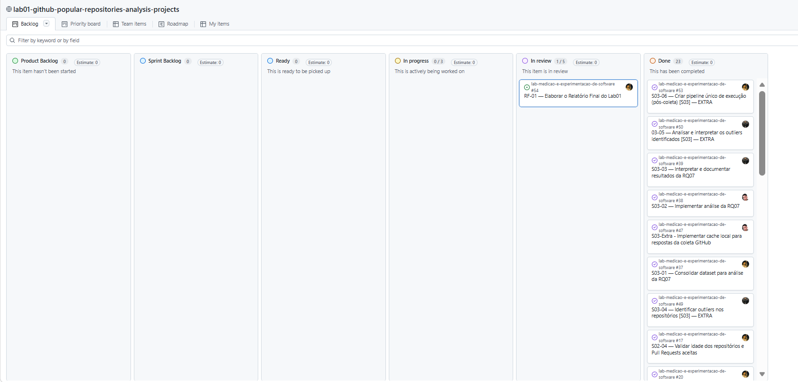

### 3.4 Ferramentas

* **Coleta:** consulta própria em **GraphQL** contra a API do GitHub (`src/github/queries/`), sem bibliotecas de terceiros para acesso à API, implementada em **C#/.NET 8** (`src/collector/`).
* **Processamento e métricas:** **Python 3** com **pandas**, em `src/analysis/` (geração do dataset processado, consolidação da RQ07) e `src/metrics/` (implementação e validação das métricas de RQ01–RQ06).
* **Visualização:** **Matplotlib**, usado tanto nos scripts de análise (`src/analysis/rq07_analysis.py`, `rq07_outliers.py`) quanto no dashboard.
* **Dashboard interativo:** **Streamlit** (`src/dashboard/app.py`), somente leitura sobre os artefatos já processados, com exportação de gráficos (PNG/SVG) e dados (CSV) — usado como fonte das figuras deste relatório.
* **Testes automatizados:** módulo `unittest` da biblioteca padrão do Python (`tests/`), cobrindo formato de CSV, métricas, análise da RQ07, outliers e o próprio dashboard (via `streamlit.testing.v1.AppTest`).
* **Gestão do processo:** **GitHub Projects (v2)** para o board Kanban, com Issues vinculadas a cada task de `docs/tasks.md` e snapshots do board exportados por `src/snapshots/snapshot_project.py`.

### 3.5 Tabela de Métricas

| RQ | Métrica | Definição Operacional | Unidade | Ferramenta / Fonte |
| --- | --- | --- | --- | --- |
| RQ01 | Idade do repositório | `collected_at − created_at` | Anos | API GraphQL do GitHub (script próprio) |
| RQ02 | Pull Requests aceitas | Contagem de Pull Requests com estado `MERGED` | PRs | API GraphQL do GitHub |
| RQ03 | Releases | `releases.totalCount` (truncado em 1.000 pela própria API) | Releases | API GraphQL do GitHub |
| RQ04 | Atividade / frequência de atualização | `collected_at − pushed_at` (dias desde o último push); complementado por `total_commits` e `development_period_days = last_commit_date − created_at` | Dias / commits | API GraphQL do GitHub |
| RQ05 | Linguagem primária | `primaryLanguage`, classificada como popular se estiver no top 10 do GitHub Octoverse 2025 | Categórica | API GraphQL do GitHub + ranking Octoverse 2025 |
| RQ06 | Percentual de issues fechadas | `closed_issues / (open_issues + closed_issues) × 100`; repositórios sem issues ficam com valor vazio, não zero | % | API GraphQL do GitHub |
| RQ07 | Comparação por grupo de linguagem (popular vs. não popular) nas métricas de RQ02/RQ03/RQ04, e correlação estrelas × métricas de RQ01–RQ06 | Mediana/média/quartis por grupo; correlação de Pearson e Spearman | Diversos | Derivado das métricas de RQ01–RQ06 (`src/analysis/rq07_analysis.py`) |

### 3.6 Inovações Propostas pelo Grupo 

* **(b) Métrica adicional: correlação direta entre estrelas e as métricas de RQ01–RQ06, dentro da RQ07.** Além da comparação por grupo (popular vs. não popular) exigida no enunciado, foi calculada a correlação de Pearson e Spearman entre `stargazer_count` e cada uma das métricas de RQ01–RQ06. Essa correlação aparece na tabela da seção 4.2/4.3 (RQ07) e no dashboard, e revelou um resultado inesperado: correlação levemente negativa entre estrelas e número de releases, discutido na seção 4.3.
* **(c) Dashboard interativo (Streamlit) como camada de exploração e exportação.** Todos os resultados de RQ01–RQ07 e da análise de outliers foram disponibilizados em um dashboard somente leitura (`src/dashboard/app.py`), com filtro por linguagem/status de arquivamento e exportação de cada gráfico/tabela em PNG, SVG e CSV. As figuras deste relatório (seção 4.2) foram exportadas diretamente dessa ferramenta, garantindo que relatório e dashboard nunca divirjam nos números apresentados.
* **(d) Análise adicional de outliers (regra de Tukey/IQR).** Complementarmente às RQs do enunciado, o grupo identificou e documentou outliers por métrica (limite moderado de 1,5× IQR e extremo de 3,0× IQR), disponíveis em `reports/drafts/outliers_2026-08-20T222207Z.md` e na aba "Outliers" do dashboard. Essa análise foi usada para qualificar as discussões de RQ02, RQ03 e RQ07 (ex.: identificar que os poucos repositórios com PRs/releases extremos são os que mais puxam a média para cima da mediana).

## 4. Resultados

### 4.1 Coleta de Dados

A coleta oficial atingiu exatamente os 1.000 repositórios-alvo, sem descartes por falha definitiva na execução registrada (`data/raw/repos_raw_2026-08-20T222207Z.csv`), com data de referência `2026-08-20T22:22:07Z`. A validação da base processada (`docs/validation/`) não identificou inconsistências críticas em nenhuma das RQs.

Principais pontos de atenção tratados como parte da qualidade dos dados, não como erro de coleta:

* **87 repositórios (8,7%)** sem linguagem primária identificada — mantidos na amostra como categoria própria (RQ05/RQ07).
* **43 repositórios (4,3%)** sem nenhuma issue (aberta ou fechada) — excluídos apenas do cálculo do percentual de fechamento (RQ06), para evitar divisão por zero.
* **23 repositórios** com `releases.totalCount` truncado em 1.000 pela própria API (RQ03) — média e máximo da RQ03 são, portanto, um piso, não uma estimativa exata.
* **27 repositórios** com `pushed_at`/`last_commit_date` poucos minutos posteriores ao `collected_at`, efeito esperado de uma coleta paginada longa contra uma API em produção (ver seção 3.1).
* **27 repositórios (2,7%)** arquivados — mantidos na amostra, com status registrado.
* Uma amostra piloto anterior de 100 repositórios (com falha parcial, 75 válidos) foi usada apenas para formar as hipóteses; todos os resultados apresentados abaixo usam exclusivamente a coleta oficial de 1.000.

### 4.2 Visualização Gráfica

> As figuras abaixo foram exportadas diretamente do dashboard Streamlit do projeto (`src/dashboard/app.py`) e estão salvas em `reports/final/figures/`.

**RQ01 — Sistemas populares são maduros/antigos?** Qual é a distribuição de idade (em anos) dos 1.000 repositórios mais populares?

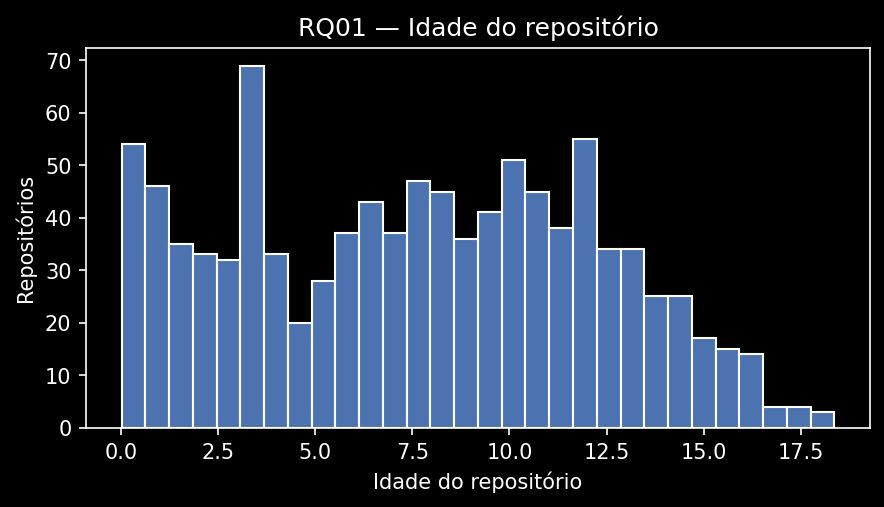

**RQ02 — Sistemas populares recebem muita contribuição externa?** Qual é a distribuição do número de Pull Requests aceitas por repositório?

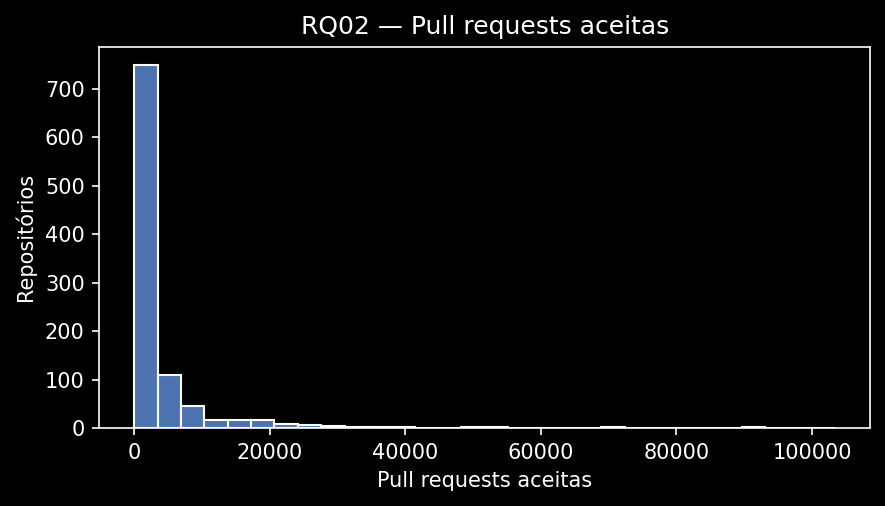

**RQ03 — Sistemas populares lançam releases com frequência?** Qual é a distribuição do número total de releases por repositório?

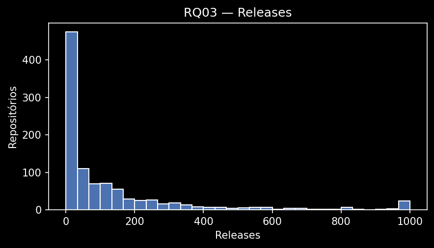

**RQ04 — Sistemas populares são atualizados com frequência?** Qual é a distribuição do tempo (em dias) desde o último push de código?

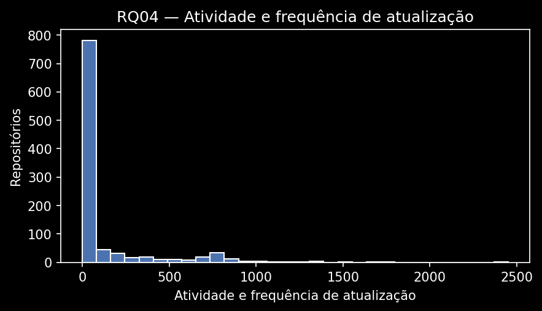

**RQ05 — Sistemas populares são escritos nas linguagens mais populares?** Qual é a distribuição dos repositórios por grupo de linguagem (popular vs. não popular, segundo o GitHub Octoverse 2025)?

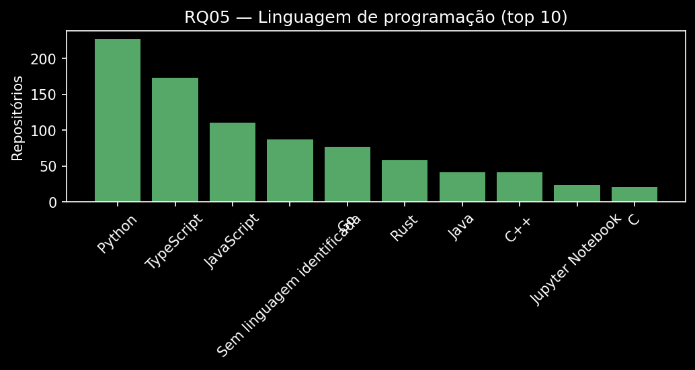

**RQ06 — Sistemas populares possuem um alto percentual de issues fechadas?** Qual é a distribuição do percentual de issues fechadas por repositório?

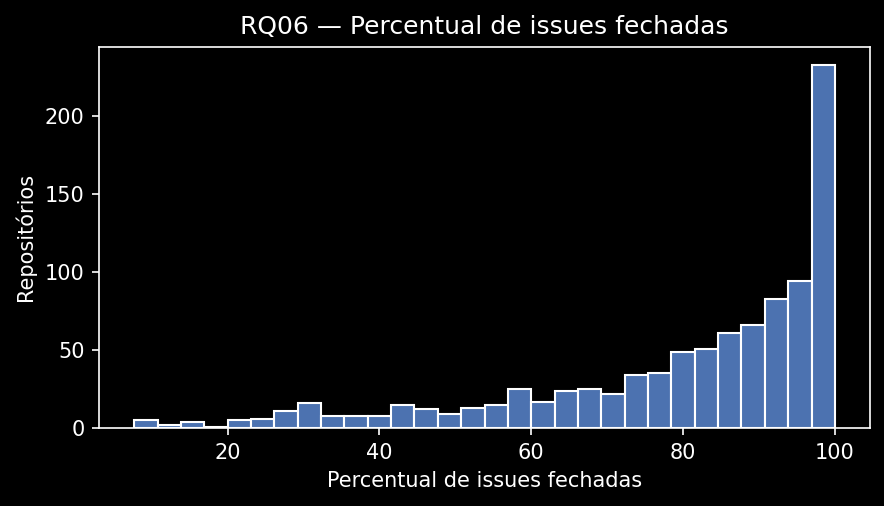

**RQ07 — Sistemas em linguagens mais populares recebem mais contribuição externa, lançam mais releases e são atualizados com mais frequência?** Como as medianas de Pull Requests aceitas, releases e dias desde o último push se comparam entre o grupo de linguagens populares e o grupo de linguagens não populares?

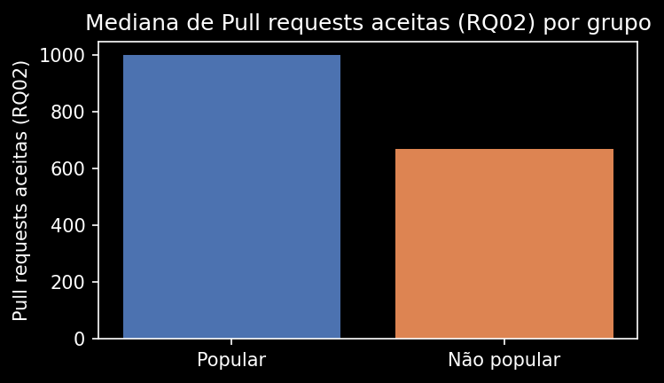
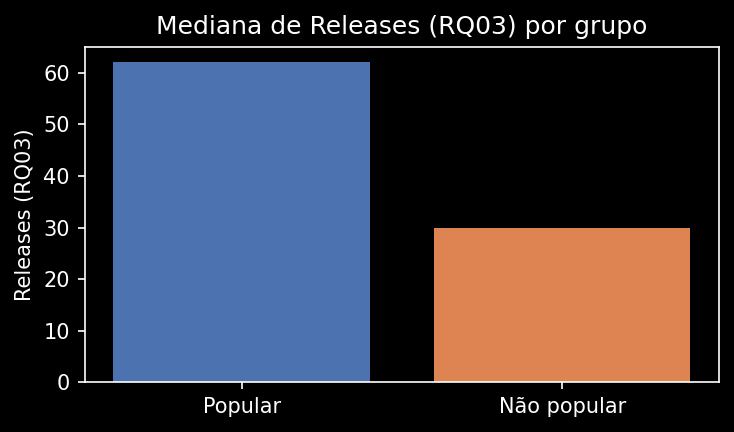
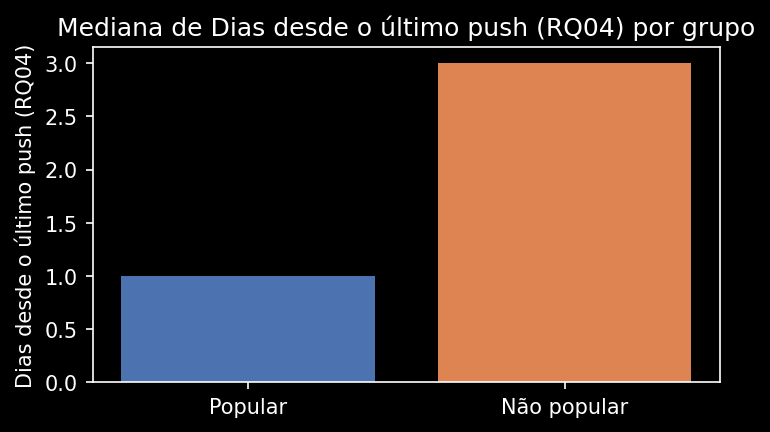

**Outliers — Quais métricas concentram mais repositórios com valores extremos (Tukey/IQR)?**

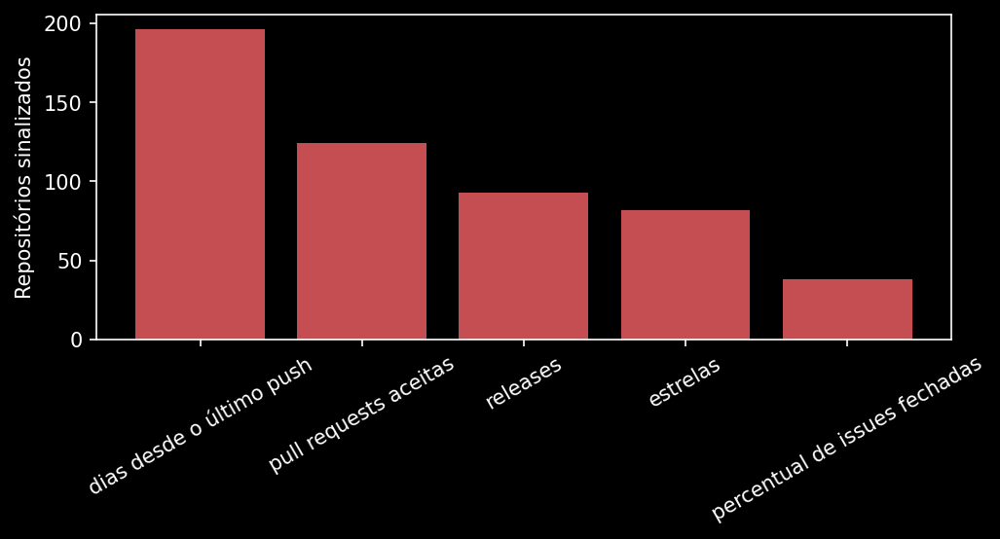

## 4.3 Discussão

**RQ01 — Idade.** Hipótese confirmada. A idade média foi de 7 anos e 8 meses (mediana: 7 anos e 9 meses), com 67,6% dos repositórios acima de 5 anos e 34,5% acima de 10 anos. Ainda assim, 13,9% têm até 2 anos — incluindo casos com poucos dias de existência —, o que mostra que idade favorece, mas não é condição necessária, para popularidade.

**RQ02 — Contribuição externa.** Hipótese confirmada. A mediana foi de 768 Pull Requests aceitas, e 72,7% dos repositórios têm ao menos 100 PRs aceitas. A média (4.243,18) é mais de 5 vezes a mediana, puxada por poucos repositórios com volume extremamente alto (ex.: `firstcontributions/first-contributions`, com 103.403 PRs) — 124 repositórios foram sinalizados como outliers nessa métrica.

**RQ03 — Releases.** Hipótese confirmada apenas pela metade. 28,5% dos repositórios nunca publicaram uma release (mediana de 39 no restante da amostra). O fator decisivo não é popularidade, e sim a presença de linguagem primária: repositórios sem linguagem (geralmente listas curadas ou material de estudo) têm 85,1% de taxa de zero releases, contra 23,1% entre os que têm linguagem. Além disso, 23 repositórios bateram no teto de 1.000 releases da API, então a média (126,86) é subestimada.

**RQ04 — Atividade.** Hipótese confirmada, de forma moderada: 11,5% da amostra está parada há mais de um ano, dentro da faixa prevista (20%–30% seria o pior caso, mas o resultado real ficou mais próximo do "ativo"). A mediana de 1 dia desde o último push e 72,9% com push no último mês mostram que a maioria segue ativa, reforçando o padrão "velho e ativo ao mesmo tempo" já sugerido pela RQ01.

**RQ05 — Linguagem.** Hipótese confirmada para a maior parte da amostra: 70,2% dos repositórios usam uma das 10 linguagens mais populares do GitHub Octoverse 2025 (destaque para Python, 22,7%, e TypeScript, 17,3%). Os 29,8% restantes incluem 8,7% sem linguagem identificada (documentação/listas) e 21,1% em linguagens fora do top 10.

**RQ06 — Issues fechadas.** Hipótese confirmada. Entre os 957 repositórios com issues, a mediana de fechamento foi de 87,5% (média: 80,2%), e 70,7% têm ao menos 75% de fechamento. Os 43 repositórios sem nenhuma issue foram tratados à parte, sem interpretar a ausência como 0% ou 100%.

**RQ07 — Linguagem popular × contribuição/releases/atividade.** Hipótese confirmada, mas com efeito bem mais fraco do que o esperado. O grupo de linguagens populares tem mediana melhor nas três métricas (1.000 vs. 670 PRs aceitas; 62 vs. 30 releases; 1 vs. 3 dias desde o último push), mas a correlação direta entre estrelas e essas métricas é fraca em toda a amostra (|r| < 0,17), inclusive com sinal levemente negativo para releases — resultado inesperado, atribuído em parte ao truncamento de `releases.totalCount` da API, que afeta justamente os repositórios mais populares. Conclusão: dentro do grupo já popular, "quão popular" pesa pouco; o que muda o resultado é "que tipo de projeto é" (ter ou não uma linguagem de programação de fato).

**Ameaças à validade.** Os dados são um retrato do momento da coleta — o número de estrelas muda continuamente, e uma nova coleta pode alterar a composição da amostra. O truncamento de `releases.totalCount` em 1.000 subestima especificamente os repositórios mais populares (RQ03/RQ07). O uso de `created_at` como proxy do primeiro commit (RQ04) pode subestimar o período de desenvolvimento em repositórios com histórico importado. A amostra piloto usada para formar as hipóteses teve uma falha parcial (75 de 100 repositórios válidos), o que é considerado ao comparar hipótese vs. resultado nas discussões acima.

As inovações do grupo (seção 3.6) aprofundaram esses resultados: a correlação direta (RQ07) revelou que a relação estrelas × releases é mais fraca — e até de sinal contrário — do que a comparação por grupo sugeria isoladamente; a análise de outliers mostrou que apenas 5 repositórios aparecem simultaneamente como extremos em PRs, releases e estrelas, o que evita generalizar o comportamento desses poucos casos para a população inteira; e o dashboard permitiu conferir e exportar todos esses números de forma consistente entre análise e relatório.

## 5. Conclusão

Os sete resultados, em conjunto, desenham um perfil comum: o repositório popular típico do GitHub é maduro (idade mediana de quase 8 anos), mantido ativamente (mediana de 1 dia desde o último push), recebe contribuição externa relevante (mediana de 768 PRs aceitas) e fecha a maior parte das issues que recebe (mediana de 87,5%). A publicação de releases é o ponto menos consistente — quase 30% da amostra nunca lançou uma —, e esse comportamento está mais associado a não ter uma linguagem de programação definida (documentação, listas) do que à popularidade em si. A linguagem de programação também influencia o resultado de forma mais modesta do que o esperado: escrever em uma linguagem popular ajuda, mas o efeito da popularidade (estrelas) isoladamente é fraco dentro do grupo de repositórios já populares.

As principais limitações do estudo são: o retrato pontual da coleta (estrelas e demais métricas mudam continuamente), o truncamento de `releases.totalCount` da API em 1.000, a aproximação de `created_at` como início do desenvolvimento, e a base de comparação com a amostra piloto, que teve cobertura parcial (75 de 100 repositórios).

Com mais tempo e recursos, o grupo investigaria: (1) uma nova coleta paginada mais rápida ou paralela, para reduzir a defasagem entre `collected_at` e os campos temporais de repositórios muito ativos; (2) uma forma de obter o número real de releases além do teto de 1.000 (ex.: paginando `releases` diretamente); e (3) expandir a correlação estrelas × métricas (inovação da seção 3.6) com um modelo de regressão controlando por linguagem e idade, em vez de correlações simples par a par.

## 6. Referências

* ZUSE, Horst. A framework of software measurement. Walter de Gruyter, 2013.
* GitHub. Octoverse 2025. Disponível em: <https://github.blog/news-insights/octoverse/octoverse-a-new-developer-joins-github-every-second-as-ai-leads-typescript-to-1/>.
