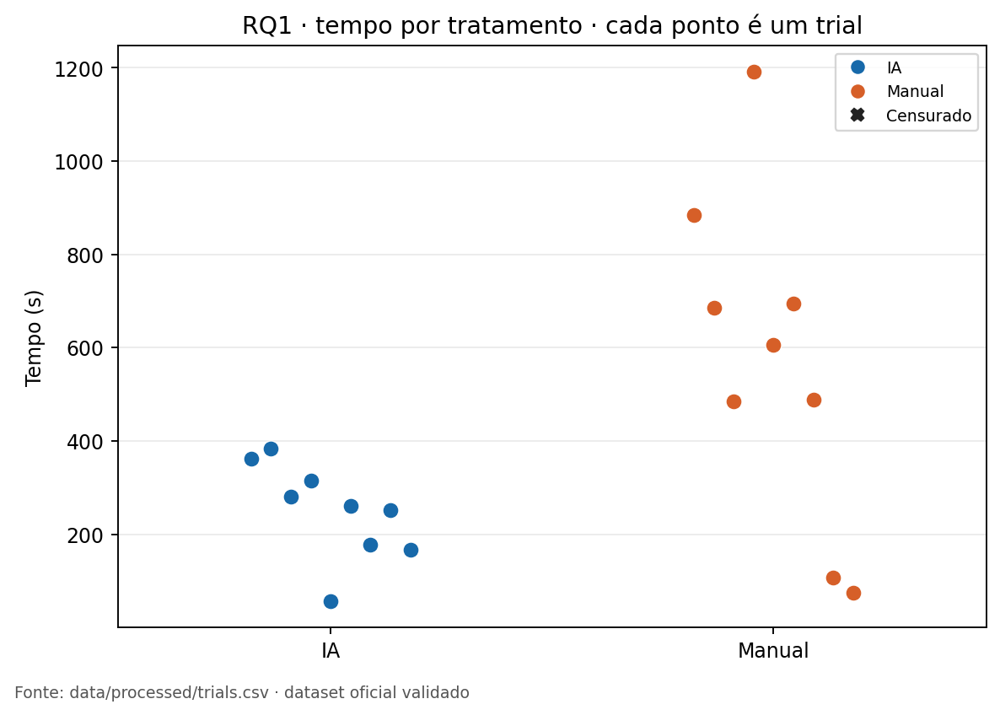
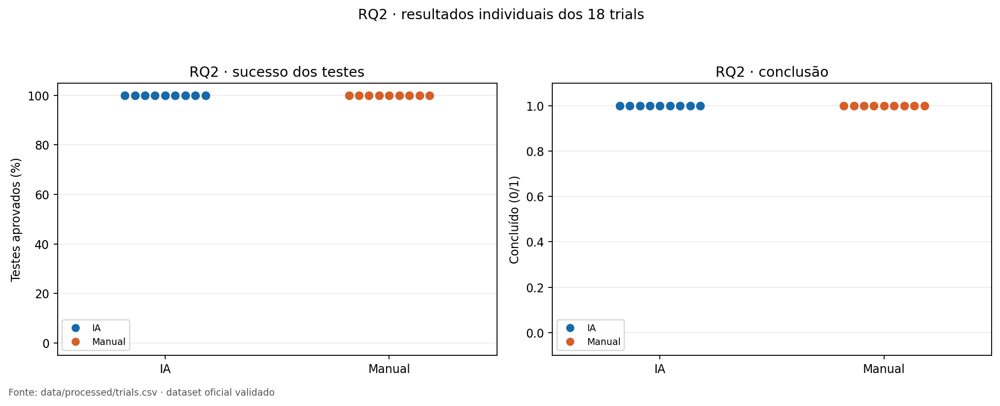
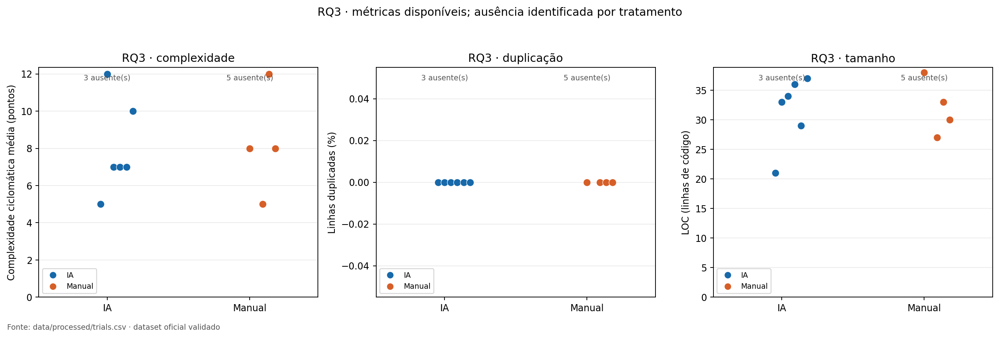

# Relatório de Laboratório

_Laboratório de Experimentação de Software — Lab02: assistentes de IA versus codificação manual_

| Campo | Valor |
| --- | --- |
| Curso | Engenharia de Software |
| Disciplina | Laboratório de Experimentação de Software |
| Turno / Período | Noite / 6º |
| Professor(a) | Danilo Maia |
| Laboratório | Lab02 — Assistentes de IA versus codificação manual |
| Grupo (trio) | Víctor Gabriel Cruz Pereira · Jonathan Sena da Silva · Matheus Fernandes de Oliveira |
| Link do repositório / GitHub Projects | https://github.com/Victorgabrielcruz/lab-medicao-e-experimentacao-de-software · https://github.com/users/Victorgabrielcruz/projects/6/views/1 |
| Data de entrega | 24/09/2026 — primeira versão completa |

---

## 1. Introdução

Assistentes de IA generativa passaram a fazer parte do fluxo de desenvolvimento de software, mas seu efeito depende da tarefa, da pessoa, do modelo e das condições de uso. Este laboratório investigou, em um cenário controlado de katas curtas, como a resolução com assistente de IA se compara à codificação manual em tempo, qualidade funcional e características estruturais do código. O objetivo não é estimar um efeito universal da IA, mas documentar de forma reproduzível o que ocorreu nos trials registrados pelo grupo.

O estudo responde às três questões de pesquisa pré-registradas em [`Docs/methodology.md`](../../Docs/methodology.md):

- **RQ1 — Tempo:** o uso de assistente de IA reduz o tempo necessário para resolver uma tarefa de programação?
- **RQ2 — Defeitos:** o uso de assistente de IA aumenta a taxa de testes de aceitação passando ao fim do trial?
- **RQ3 — Estrutura:** o uso de assistente de IA altera a complexidade ciclomática ou a duplicação do código produzido?

As hipóteses foram definidas antes da execução. Para RQ1, **H0₁** afirma que a mediana de `T_manual − T_IA` é zero, e **H1₁** que ela é maior que zero. Para RQ2, **H0₂** afirma que a mediana de `S_IA − S_manual` é zero, e **H1₂** que ela é maior que zero. Para RQ3, as hipóteses são bicaudais: **H0₃a/H0₃b** afirmam que as medianas de `CC_IA − CC_manual` e de `DUP_IA − DUP_manual` são zero; **H1₃a/H1₃b** afirmam que são diferentes de zero. As direções são importantes: diferença positiva em RQ1 favorece IA; em RQ2 e RQ3, ela indica maior valor com IA.

## 2. Contexto

O Lab02 foi executado por três estudantes de graduação identificados, nas análises, como P01, P02 e P03. Cada participante realizou seis trials em seis katas inéditas, organizadas em três blocos de dificuldade equivalente: B1 (K01/K02), B2 (K03/K04) e B3 (K05/K06). Cada bloco fornece um par: uma kata sob tratamento IA e a outra sob tratamento Manual. O desenho é, portanto, **crossover within-subject**, com nove comparações participante × bloco e 18 trials no total.

A alocação foi congelada em 10/09/2026 com a semente `20260910`. O plano contrabalanceou a sequência de tratamentos; a ordem efetivamente executada foi registrada para não ocultar desvios.

| Participante | Sequência planejada de tratamentos | Ordem efetiva das katas |
| --- | --- | --- |
| P01 | IA → Manual → IA → Manual → IA → Manual | 1 → 4 → 5 → 3 → 2 → 6 |
| P02 | Manual → IA → Manual → IA → Manual → IA | 1 → 3 → 5 → 4 → 2 → 6 |
| P03 | IA → Manual → Manual → IA → IA → Manual | 1 → 2 → 3 → 4 → 5 → 6 |

O time-box foi de 35 minutos (2.100 s) por trial. Um trial que alcançasse o limite deveria permanecer no dataset como censurado, com tempo observado de 2.100 s; nenhum dos 18 trials oficiais foi censurado. Pausas registradas ficaram abaixo de 15 minutos. O dataset mantém a cadeia `Issue → trial_id → commit → dados brutos → dataset processado → análise/figura`, o que permite localizar o `trial.json`, o JUnit final, as métricas estáticas e o código preservado de cada observação.

## 3. Metodologia

### 3.1 Principais desafios

- **Disponibilidade desigual de métricas estruturais.** Oito trials não têm métricas de LOC, complexidade, duplicação e manutenibilidade; assim, RQ3 tem 10/18 observações de tratamento e apenas 4/9 pares completos. Essas lacunas foram preservadas como ausentes, sem imputação e sem conversão para zero.
- **Conflito de evidências em P01-K02-manual.** O JUnit final bruto registra 0/5, enquanto o `poll` documentado registra 5/5 a 884,796 s. A nota de qualidade preservada explica a condição de corrida do coletor; o dataset oficial utiliza 5/5, mas a ressalva permanece explícita no relatório.
- **Aderência parcial ao tratamento planejado.** O protocolo pré-registrou Codex CLI, mas cinco trials IA usaram Claude e quatro usaram Codex. Há também desvios de versão e registros de prompts não exportáveis. Esses fatos reduzem a capacidade de atribuir resultados a um único modelo.
- **Amostra pequena e dependência entre pares.** Nove pares vêm de apenas três participantes; os pares de uma mesma pessoa não são independentes. Por isso, valores de p e intervalos são apresentados como evidência exploratória, complementados por uma análise de sensibilidade com uma mediana por participante.

### 3.2 Tomadas de decisão

- A unidade experimental é um **trial**: uma pessoa, uma kata, um tratamento e um limite de tempo. A comparação pareada usa participante e bloco de dificuldade, não a mesma kata repetida.
- `duration_seconds` mede tempo até todos os testes passarem; `success_rate = passed_tests / total_tests × 100` é a métrica funcional primária. Testes falhando são complementares.
- Para RQ3, a complexidade ciclomática média e a duplicação são confirmatórias; LOC é controle obrigatório e o Índice de Manutenibilidade (MI) é exploratório. Métricas ausentes excluem apenas o par daquela métrica.
- A análise usa Wilcoxon exato por permutação de sinais dos postos não nulos, com α = 0,05. RQ1/RQ2 usam alternativa unilateral; RQ3 é bicaudal e ajusta complexidade/duplicação por Holm. Os ICs bootstrap de 95% são exploratórios.
- O outlier `P02-K02-manual` (1.191 s) foi mantido. A validação encontrou 0 erro crítico, 31 avisos e 1 observação extrema preservada; não houve limpeza manual dos valores que favorecessem uma hipótese.

### 3.3 Etapas

| Etapa | Entrega rastreável | Evidência principal |
| --- | --- | --- |
| Planejamento | protocolo, katas, blocos e alocação congelada | `Docs/methodology.md`, `data/metadata/allocation.csv` |
| Execução | 18 registros de trial, código final e testes | `data/raw/trials/`, `trials/` |
| Consolidação | dataset único, erros e validação | `data/processed/trials.csv`, `consolidation-errors.csv`, `reports/drafts/data-validation.md` |
| Análise | RQ1–RQ3, resultados estatísticos e dashboard | `scripts/run_analysis.py`, `scripts/generate_dashboard.py`, `reports/figures/dashboard/` |
| Relatório final | tabela reproduzível, figuras e documento | `scripts/generate_final_report_table.py`, `reports/final/` |

### 3.4 Ferramentas e ambiente

O ambiente planejado foi Python 3.12.14, pytest 9.1.1, Radon 6.0.1, JSCPD 5.2.0, Node 24.19.0, npm 11.17.0, uv 0.12.10 e VS Code 1.137.0. Para análise e visualização foram usados SciPy 1.16.2, Matplotlib 3.10.6 e Streamlit 1.64.0. As versões, configurações e dependências permanecem em `data/metadata/environment.json`, `requirements*.txt`, `requirements.lock`, `radon.cfg` e `.jscpd.json`.

O tratamento IA pré-registrado foi Codex CLI 0.154.0, modelo `gpt-5.3-codex`, via ChatGPT Pro, em modo chat/agente pelo terminal, com acesso verificado em 10/09/2026 e contexto novo a cada trial. A execução real contém exceções: P01 usou Claude Code 2.1.273 com `claude-sonnet-5`; P02-K01-ai e P02-K04-ai também registram Claude, com versão esperada 2.1.273 e detectada 2.1.276. O relatório trata o tratamento como “uso de assistente de IA” e não como um efeito exclusivo de uma ferramenta.

### 3.5 Tabela de métricas

| RQ | Métrica | Definição operacional | Unidade | Fonte |
| --- | --- | --- | --- | --- |
| RQ1 | Tempo até verde | Tempo observado até todos os testes de aceitação passarem; 2.100 s se censurado | segundos | `trial.json`, logs e dataset consolidado |
| RQ2 | Taxa de sucesso | `passed_tests / total_tests × 100` ao fim do trial | percentual | JUnit final, `trial.json` e nota de qualidade quando aplicável |
| RQ3 | Complexidade média | Média da complexidade ciclomática por função/método | pontos | Radon em `metrics.json` |
| RQ3 | Duplicação | Linhas duplicadas relativas ao código de produção final | percentual | JSCPD em `metrics.json` |
| RQ3 | LOC e MI | Controles de tamanho e análise exploratória de manutenibilidade | linhas / pontos | `metrics.json` |

### 3.6 Reprodutibilidade e contribuição técnica

O pipeline é executado da pasta `Lab02` e não requer edição manual do dataset:

```text
python scripts/build_dataset.py
python scripts/validate_dataset.py
python scripts/run_analysis.py
python scripts/generate_dashboard.py --dataset data/processed/trials.csv --output reports/figures/dashboard
python scripts/generate_final_report_table.py --input data/processed/statistical-results.csv --output-dir reports/final/figures
python scripts/generate_final_report_docx.py --template Docs/templates/Template_Relatorio_Laboratorio.docx
```

O novo `scripts/generate_final_report_table.py` gera a Tabela 1 em CSV e Markdown diretamente de `data/processed/statistical-results.csv`; seus testes ficam em `tests/test_final_report_table.py`. O gerador do documento usa `python-docx==1.2.0` (fixado em `requirements-report.txt`) e a cópia versionada do template fornecido. As figuras selecionadas nesta versão são cópias rastreáveis das saídas do dashboard; suas fontes, nomes originais e geradores estão documentados em [`figures/README.md`](figures/README.md).

## 4. Resultados

### 4.1 Coleta, cobertura e qualidade

O dataset oficial possui exatamente 18 linhas e 18 `trial_id` únicos: nove tratamentos IA e nove Manuais, todos concluídos. Há nove pares válidos para RQ1/RQ2, formados por P01–P03 e B1–B3. A validação de 23/09/2026 autorizou o uso do dataset nas três RQs, sem achado crítico. O relatório de consolidação de erros e os 31 avisos permanecem disponíveis; eles indicam limitações de cobertura, não dados fabricados.

| Situação | Resultado | Tratamento no relatório |
| --- | --- | --- |
| Trials censurados | 0/18 | nenhum valor foi artificialmente limitado; a regra de 2.100 s continua documentada |
| Métricas estruturais ausentes | 8/18 trials; 4/9 pares completos | células vazias; exclusão somente da comparação estrutural correspondente |
| Dificuldade percebida | ausente em todos os trials | não analisada como desfecho |
| Logs de prompts | indisponíveis em 5 trials IA | ausência declarada; não inferida a partir de texto livre |
| Tentativas IA invalidadas | 3 tentativas fora do dataset oficial | excluídas por falta de interação real documentada; possível exposição prévia é ameaça à validade |
| Outlier de tempo | P02-K02-manual, 1.191 s | mantido, identificado e não removido |

**Tabela 1 — Síntese quantitativa das RQs.** A tabela foi produzida pelo script versionado e também está disponível em [`figures/tabela-resumo-rqs.md`](figures/tabela-resumo-rqs.md) e [`figures/tabela-resumo-rqs.csv`](figures/tabela-resumo-rqs.csv).

<!-- GENERATED TABLE: figures/tabela-resumo-rqs.csv -->

### 4.2 Visualizações e respostas objetivas

#### RQ1 — Tempo

Nos nove pares registrados, a mediana do tempo foi 606 s no tratamento Manual e 261 s no tratamento IA. A diferença pareada mediana `Manual − IA` foi +310 s; sete pares favoreceram IA. O Wilcoxon unilateral resultou em `p=0,0098` e a correlação bisserial de postos foi 0,87, mas o intervalo exploratório de 95% foi amplo (−92 a 549 s). **Resposta à RQ1:** para os trials observados, IA esteve associada a menor tempo na maioria dos pares; isso não demonstra um efeito causal geral.



#### RQ2 — Qualidade funcional

Os dois tratamentos tiveram mediana de 100% de sucesso, com nove diferenças pareadas iguais a zero; por isso, o teste de Wilcoxon e o tamanho de efeito ficam indefinidos por empates totais. **Resposta à RQ2:** não se observou diferença na taxa final de testes passando. O resultado não prova equivalência funcional nem ausência de defeitos fora da suíte de aceitação.



#### RQ3 — Qualidade estrutural

Na complexidade ciclomática média, os quatro pares completos produziram diferenças IA − Manual de +4, +2, −5 e +2 pontos, com mediana +2. O teste bicaudal resultou em `p=0,7500`, Holm = 1,0000, `r=0,20` e IC exploratório de −5 a 4 pontos. A duplicação foi 0% nos quatro pares completos, todos empatados. LOC mediano foi 31,50 no Manual e 33,50 com IA; MI mediano foi 63,60 e 78,98, respectivamente, mas ambas são leituras exploratórias em amostras marginais de tamanhos diferentes. **Resposta à RQ3:** os dados disponíveis não sustentam uma alteração estrutural geral; a complexidade aponta +2 pontos com IA nos pares observáveis, com incerteza ampla e cobertura incompleta.



### 4.3 Discussão

#### RQ1 — Interpretação do efeito de tempo

O efeito observacional em RQ1 é grande em direção favorável à IA: a diferença pareada mediana foi de 310 s e sete de nove pares apontaram para menor tempo com assistente. Ainda assim, a síntese por participante produz medianas de +302 s (P01), +549 s (P02) e −92 s (P03), com `p=0,25` para apenas três resumos. Essa sensibilidade mostra que o resultado agregado não deve ser interpretado como uma estimativa independente de nove pessoas. Diferenças de experiência, ordem de execução, familiaridade com as katas e o próprio assistente podem explicar parte do contraste.

#### RQ2 — Teto funcional e evidência conflitante

O desfecho ficou no teto: 18/18 trials no dataset consolidado têm 100% de sucesso. Essa leitura é condicional à interpretação auditada de P01-K02-manual: o `poll` registrado em 884,796 s indica 5/5, enquanto o JUnit final bruto indica 0/5 e `NotImplementedError`. Se o JUnit final fosse usado isoladamente, haveria 17/18 verdes e um par favorável à IA. A decisão de consolidação é rastreável e não altera o arquivo bruto, mas torna RQ2 particularmente sensível à qualidade do coletor. Além disso, teste de aceitação não mede todos os defeitos possíveis.

#### RQ3 — Cobertura incompleta e magnitudes

RQ3 é a comparação mais limitada. Oito trials sem métricas estruturais reduzem a análise pareada a quatro pares, e P01 não possui nenhuma observação estrutural. A mediana +2 de complexidade com IA é uma magnitude potencialmente relevante para uma kata curta, mas o IC exploratório inclui melhora de cinco pontos e piora de quatro; não há precisão para afirmar direção consistente. A duplicação nula representa empate sob a configuração específica do JSCPD, não prova ausência de repetição conceitual. As diferenças em LOC e MI ajudam a contextualizar tamanho/manutenibilidade, mas não substituem o teste pareado pré-registrado.

#### Ameaças à validade

- **Interna:** sequência efetiva desviou do contrabalanceamento, especialmente P02, que realizou os três trials Manuais antes dos de IA; P02-K04-ai terminou às 23:59 de 17/09 e P02-K01-ai às 00:10 de 18/09, após o prazo planejado.
- **De construto:** o tratamento IA não foi homogêneo entre Codex e Claude; cinco logs de prompt não puderam ser exportados. RQ2 depende de uma correção de interpretação documentada do coletor.
- **De conclusão:** há pseudorreplicação, três participantes, ausência estrutural e empates totais. Valores de p, tamanhos de efeito e ICs são exploratórios.
- **Externa:** são seis katas curtas, estudantes de uma única turma e ferramentas/versões específicas. Os resultados não se generalizam automaticamente para tarefas industriais, outros modelos ou equipes.
- **De histórico/aprendizagem:** três tentativas IA invalidadas foram excluídas por ausência de interação real; a exposição prévia à kata em uma retentativa ainda pode influenciar o desempenho posterior.

## 5. Conclusão

Esta primeira versão do relatório consolida um experimento com 18 trials rastreáveis e um pipeline que pode ser reexecutado. A evidência observada favorece o uso de assistente de IA para tempo em sete dos nove pares, não mostra diferença funcional na taxa final de testes e é inconclusiva para qualidade estrutural devido à disponibilidade limitada das métricas. A interpretação mais responsável é local ao experimento: há indícios de menor tempo com IA sob estas condições, sem evidência de ganho funcional adicional e sem precisão suficiente para caracterizar o efeito estrutural.

Os resultados desfavoráveis ou ambíguos foram mantidos: os empates de RQ2, a direção de complexidade potencialmente pior com IA e as ausências de RQ3 não foram ocultados. Uma replicação mais forte precisaria de mais participantes, instrumentos com exportação de prompts verificável, um único assistente/versão, registro de métricas estruturais completo e contrabalanceamento efetivamente seguido.

## 6. Referências

- LAB02. [Metodologia e protocolo pré-registrado](../../Docs/methodology.md). Repositório do experimento, 2026.
- LAB02. [Dataset processado de trials](../../data/processed/trials.csv), [resultados estatísticos](../../data/processed/statistical-results.csv) e [relatório de validação](../drafts/data-validation.md), 2026.
- LAB02. [Respostas consolidadas às RQs](../drafts/rq-answers.md), [ameaças à validade](../drafts/validity-threats.md), [auditoria de execução](../../Docs/execution-audit.md) e [decisões do protocolo](../../Docs/protocol-decisions.md), 2026.
- WILCOXON, Frank. Individual Comparisons by Ranking Methods. *Biometrics Bulletin*, v. 1, n. 6, p. 80–83, 1945.
- ZUSE, Horst. *A Framework of Software Measurement*. Walter de Gruyter, 2013.
- Repositório: https://github.com/Victorgabrielcruz/lab-medicao-e-experimentacao-de-software. GitHub Projects: https://github.com/users/Victorgabrielcruz/projects/6/views/1.
